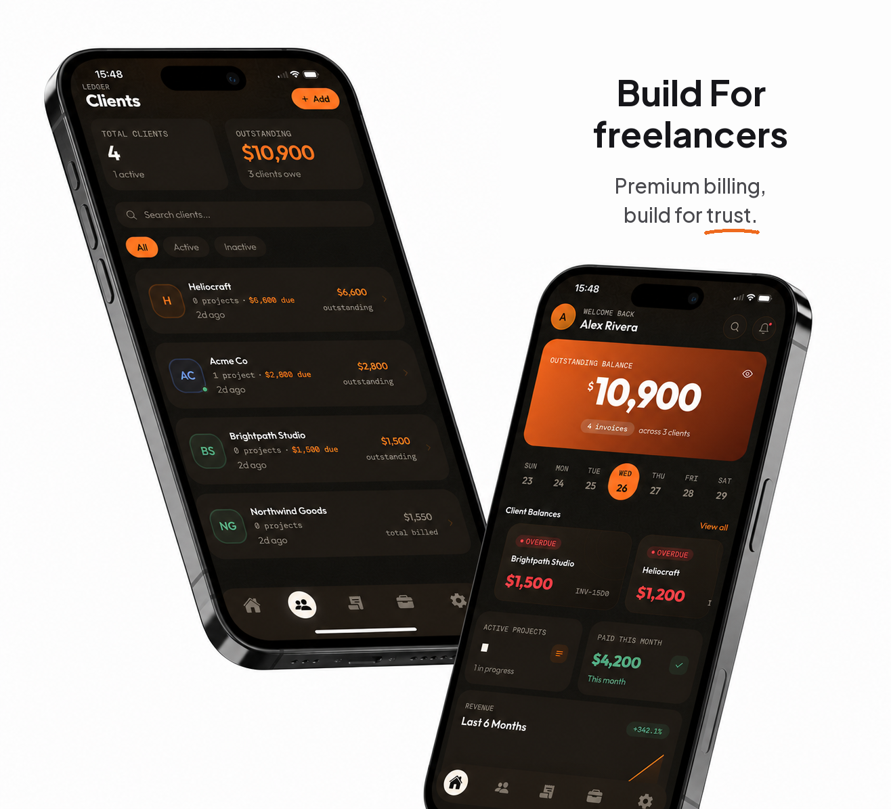

# Ledger



A mobile client-portal app for freelancers and small agencies — manage clients, projects, invoices,
and get paid, from one app. Two roles share the same codebase: **Freelancer** (full management view)
and **Client** (scoped read-only + payment view).

Built with Expo (React Native + TypeScript) and Supabase (Postgres, Auth, Row Level Security,
Realtime). Invoice payments are **simulated** — see [Payments](#4-payments--simulated) below for why.

## Preview the app

```bash
npx expo start
```

- **Web** — press `w`, or open `http://localhost:8081` directly. Fastest way to look at something
  without any native toolchain installed.
- **iOS Simulator** — press `i` (needs Xcode on macOS), or scan the QR with the **Expo Go** app on a
  physical device for a quick look (native modules that need a real dev build — biometrics, camera —
  won't work in Expo Go).
- **Android emulator/device** — press `a` (needs Android Studio), or scan the QR with Expo Go.

**Log in without creating an account**: tap **Continue as demo freelancer** on the login screen, or
sign in directly with `demo@ledgerapp.dev` / `ledger-demo-2026` (seeded — see
[Seed demo data](#3-seed-demo-data)). To see the client-side view, sign up fresh and pick **I'm a
client**, or ask a freelancer account to add you.

## Features

**Freelancer side**
- **Dashboard** — outstanding balance as a gradient hero card with a tap-to-hide toggle (masks the
  figure to `••••••` if someone's looking over your shoulder), a 6-month revenue chart, client
  balances, today/upcoming invoices, search + overdue filter, one-tap "Send Payment Reminders."
- **Clients** — list with outstanding totals, add new (creates a real linked account via an Edge
  Function), per-client detail with balance and invoice history, and CSV import for migrating a
  client list off a spreadsheet — see [`(freelancer)/clients/import.tsx`](<src/app/(freelancer)/clients/import.tsx>).
- **Invoices** — list filterable by draft/sent/paid/overdue, detail view, payment reminders,
  recurring invoices (save a template — weekly/monthly/quarterly/yearly — and it generates a real
  invoice on schedule with no app or server needing to be open; see
  [Recurring invoices](#6-recurring-invoices) below), a per-invoice currency (10 common
  currencies — see [Multi-currency](#7-multi-currency) below), and a big-digit tap-to-enter keypad
  for the amount instead of the OS keyboard (see
  [`components/number-pad.tsx`](src/components/number-pad.tsx)).
- **Projects** — list with progress rings, milestones, and status (active / on hold / completed).
- **Messaging** — realtime per-project thread with the client.
- **Settings** — profile, multi-theme picker (Amber Noir / Dark Cool / Light, each dark+light aware),
  default currency, biometric app-lock, notification preferences, simulated Pro subscription/upgrade, email & password,
  Privacy & Data (real data counts + account deletion), Legal (Privacy Policy / Terms of Service).

**Client side**
- Scoped read-only view of the projects and invoices a freelancer has shared, realtime messaging, and
  a simulated card-entry payment flow — see [Payments](#4-payments--simulated).
- Its own Settings: profile, biometric lock, Privacy & Data, account deletion, Legal.

**Both roles**
- A first-run welcome walkthrough (3 slides, skippable) — a device-local one-time flag, same pattern
  as the biometric-unlock prompt, so it shows once per device regardless of how old the account is.
  See [`onboarding.tsx`](src/app/onboarding.tsx) / [`use-onboarding.ts`](src/hooks/use-onboarding.ts).

**Security & privacy**
- Row Level Security on every table; a `freelancer_clients_insert` / `projects_all_freelancer` /
  `invoices_all_freelancer` / `subscriptions_all_freelancer` policy set that checks actual role via
  `is_freelancer()`, not just row ownership.
- Column-level `GRANT`s on `profiles` so a user can update their own name/avatar/theme/prefs but can't
  self-elevate `role` through the same endpoint (`WITH CHECK` alone can't block that — see
  [`db/migrations/007_security_hardening.sql`](db/migrations/007_security_hardening.sql)).
- Real account deletion (not just sign-out): an Edge Function using the admin API, relying on
  cascading FKs to remove everything owned by the account — see
  [`delete-account`](supabase/functions/delete-account/index.ts).
- A stale/orphaned local session (e.g. the account was deleted elsewhere) signs itself out on next
  load instead of leaving the app stuck on a blank screen — see
  [`auth-context.tsx`](src/contexts/auth-context.tsx).
- Push notifications, biometric unlock, offline dashboard caching (`expo-sqlite`).

## Stack

- Expo SDK 57, Expo Router (file-based navigation), TypeScript
- Supabase — Postgres, Auth, RLS, Realtime, Storage, Edge Functions
- Simulated card-entry payment flow (no real processor — see below) — invoice payments
- `expo-local-authentication` — biometric app unlock
- `expo-sqlite` — local cache for offline dashboard/invoice/client data
- `react-native-reanimated` + `react-native-gesture-handler` — animated counters, transitions, the
  unlock → dashboard reveal, and the payment success checkmark
- `react-native-svg` — the revenue chart (hand-rolled, not a chart library)
- `expo-camera` / `expo-image-picker` — receipt scanning on projects
- `expo-notifications` — push notifications, with an in-app foreground toast

## Project layout

```
src/
  app/                    Expo Router routes
    (auth)/                 login, signup
    (freelancer)/            dashboard, clients (+ new), invoices, projects, settings
      settings/               index, email-password, privacy-data
    (client)/                home, invoices (+ pay), messages, settings
    enable-biometric.tsx    one-time post-login prompt
    privacy-policy.tsx      role-agnostic — lives at app root, not inside either role group
    terms.tsx                (role layouts redirect away from each other, so shared static
                              content has to sit outside both)
    upgrade.tsx             simulated Pro subscription flow
    _layout.tsx             providers, biometric lock overlay
  components/             shared UI — see Components below
  contexts/               auth, app-lock (biometric), notification toast
  hooks/                  use-cached-query (offline-aware fetch), theme
  lib/                    supabase client, queries, storage, payments, notifications, account deletion
  theme/                  theme definitions (Amber Noir / Dark Cool / Light) + provider
  animations/easing.ts    shared easing/duration/spring tokens
  types/database.ts       row types matching db/schema.sql
db/
  schema.sql              tables, RLS policies, triggers, storage bucket + policies
  migrations/              incremental changes to apply to an already-running project
scripts/
  seed.ts                 seeds one demo freelancer, 4 clients, projects, invoices, messages
supabase/functions/
  push-notify/             sends push on invoice-paid / new-message (Database Webhooks)
  simulate-payment/        the only place an invoice flips to `paid` (called from the app, no processor)
  create-client/           creates a real linked client account (admin API — profiles.id FKs to auth.users)
  delete-account/          deletes the caller's own account + everything it owns (admin API, cascading FKs)
eas.json                 EAS Build profiles — see Build & distribution below
```

## Components

A few worth knowing about, in [`src/components`](src/components):

- **`themed-text.tsx` / `themed-view.tsx`** — every piece of text/background in the app goes through
  these, reading color/font/size from the active theme rather than hardcoding values.
- **`theme-picker.tsx`** — the Settings theme switcher; persists the choice to `profiles.theme`.
- **`animated-counter.tsx`** — counts up to a numeric value on mount/change; used for every dashboard
  figure. Formats with a pinned `en-US` locale (see [A platform quirk worth
  knowing](#a-platform-quirk-worth-knowing) below).
- **`revenue-chart.tsx`** — the dashboard's 6-month trend line, hand-rolled in `react-native-svg`
  rather than a charting library.
- **`virtual-card-preview.tsx`** — the simulated card-entry mockup shown on the client payment screen.
- **`delete-account-section.tsx`** — the reveal → type-DELETE-to-confirm account deletion UI, shared
  between the freelancer and client Privacy & Data screens.
- **`progress-ring.tsx` / `status-badge.tsx`** — the circular project-progress indicator and the
  colored draft/sent/paid/overdue pills.
- **`icons.tsx`** — the whole icon set is hand-drawn inline SVG (no `@expo/vector-icons` dependency
  for app chrome), so every icon matches the theme's stroke weight exactly.
- **`lock-screen.tsx`** — the biometric unlock overlay, rendered above the whole app in the root
  layout.

## Setup

### 1. Supabase project

1. Create a project at [supabase.com](https://supabase.com).
2. In the SQL editor, run [`db/schema.sql`](db/schema.sql) — this creates every table, the RLS
   policies, the `handle_new_user` signup trigger, the activity-feed triggers, and the `attachments`
   storage bucket + its policies.
   - Already ran an older version of this schema? Run whichever of
     [`db/migrations`](db/migrations) you haven't applied yet, in order — `002` swaps the original
     Stripe field for Flutterwave's, `003` renames those to the processor-neutral `payment_ref` /
     `payment_transaction_id` used now that payments are simulated, `004` adds the `profiles.theme`
     column for the multi-theme system, `005` renames its default/backfilled value from the retired
     `lime-noir` theme to `amber-noir`.
3. Under **Database → Replication**, confirm `activity_events`, `messages`, and `invoices` are in the
   `supabase_realtime` publication (the schema script adds them, but double-check).
4. Copy your project URL and anon key into `.env` (copy `.env.example` first).

### 2. App environment

```bash
cp .env.example .env
# fill in EXPO_PUBLIC_SUPABASE_URL, EXPO_PUBLIC_SUPABASE_ANON_KEY,
# and SUPABASE_SERVICE_ROLE_KEY (seed script only)
```

```bash
npm install
npx expo start
```

### 3. Seed demo data

```bash
npm run seed
```

Creates one demo freelancer (`demo@ledgerapp.dev`), 4 fake clients, 3 projects with milestones, a
message thread, and 8 invoices spread across draft/sent/paid/overdue. The app's "Continue as demo
freelancer" login button uses this account. The seed script needs `SUPABASE_SERVICE_ROLE_KEY` (it
bypasses RLS) — never ship that key in the app itself, only use it locally / in CI.

### 4. Payments — simulated

Neither Stripe nor Flutterwave support account creation from this project's target market (Tanzania),
so invoice payments are simulated end-to-end instead of running through any real processor. The UI,
animation, and data flow all work exactly as if a real payment happened — only the money-movement
call is mocked:

1. Tap **Pay** on the client invoice screen → a card-entry screen (number, expiry, CVC, name —
   cosmetic only, no real validation against a card network). See
   [`(client)/invoices/[id]/pay.tsx`](<src/app/(client)/invoices/[id]/pay.tsx>).
2. On submit, an artificial 1.5–2.5s "Processing…" delay runs client-side
   ([`use-simulated-payment.ts`](src/hooks/use-simulated-payment.ts)) — this is what makes it feel
   real instead of instant.
3. The outcome is decided client-side too: a card number ending in `0000` always declines; otherwise
   there's a random ~1-in-6 chance of a simulated decline, to exercise both UX paths. No card data is
   ever sent anywhere in either case.
4. Only on a simulated **success** does anything hit the network: the app calls the `simulate-payment`
   Edge Function, which is the one part of this flow that's genuinely real — an authenticated,
   server-side write of `invoices.status = 'paid'` (clients have no UPDATE grant on `invoices` under
   RLS, so this can't happen client-side, exactly like a real payment integration would enforce).
5. That update fires the existing `push-notify` webhook and activity feed exactly as before, and the
   app shows the same success checkmark + haptic feedback originally spec'd for a real payment sheet.

Setup — one function, no secrets, no third-party account needed:

```bash
supabase functions deploy simulate-payment
```

**Swapping in a real processor later**: the architecture — Edge Functions, the `payment_ref` /
`payment_transaction_id` invoice fields, RLS keeping payment writes server-side, the realtime/push
pipeline reacting to `invoices.status` — is exactly what a real Stripe/Flutterwave/local-gateway
integration would also need. Only `simulate-payment`'s body (and the client-side decision step in
`use-simulated-payment.ts`) would need to become a real API call; nothing downstream changes. Worth
being upfront about this being simulated in any write-up of this project — it's an honest framing,
and the parts that are real (UX, data flow, realtime sync) are still real.

### 5. Push notifications

```bash
supabase functions deploy push-notify
```

Then, in the Supabase dashboard under **Database → Webhooks**, create two webhooks pointing at the
`push-notify` function URL: one on `invoices` (UPDATE), one on `messages` (INSERT). The function
figures out the recipient and sends via Expo's push API — no extra secrets needed beyond the
service-role key Supabase injects automatically.

Push tokens only register on a physical device (not the simulator/emulator) and require an
[EAS project ID](https://docs.expo.dev/push-notifications/push-notifications-setup/) once you build
with EAS.

### 6. Recurring invoices

Handled entirely in Postgres via [`pg_cron`](https://github.com/citusdata/pg_cron) — no Edge Function
or external scheduler needed, so it keeps running even if nothing client-side is ever open. Enabled
by [`db/migrations/008_recurring_invoices.sql`](db/migrations/008_recurring_invoices.sql) (already
part of `db/schema.sql` for fresh installs), which:

1. Adds `invoice_templates` (a saved recurring schedule — client, amount, interval, next run date)
   and `invoices.template_id` (set on invoices a template generated, for the UI's "recurring" badge).
2. Defines `generate_recurring_invoices()`, a `security definer` function that inserts a new invoice
   for every template due to run, then advances that template's `next_run_date`.
3. Schedules it via `cron.schedule('generate-recurring-invoices', '0 6 * * *', ...)` — daily at 06:00
   UTC.

`pg_cron` needs to be enabled on the project (`create extension pg_cron`) — available on every
Supabase plan including Free, but confirm it under **Database → Extensions** if the schedule doesn't
seem to be firing. To generate due invoices immediately instead of waiting for the next cron tick
(e.g. while testing), run `select public.generate_recurring_invoices();` directly in the SQL editor.

### 7. Multi-currency

`invoices.currency` (and `invoice_templates.currency`) already existed for a while before anything
in the UI actually let a freelancer set it to something other than the `usd` default — added by
[`db/migrations/009_multi_currency.sql`](db/migrations/009_multi_currency.sql):

- `profiles.default_currency` — set from Settings → Default Currency
  ([`settings/currency.tsx`](<src/app/(freelancer)/settings/currency.tsx>)), pre-fills the currency
  picker on new invoices ([`invoices/new.tsx`](<src/app/(freelancer)/invoices/new.tsx>)).
- The 10 supported currencies live in [`src/constants/currencies.ts`](src/constants/currencies.ts)
  — add more there if you need one that isn't listed; any valid ISO 4217 code works, since
  `getCurrencySymbol`/`formatCurrency` (in [`src/lib/format.ts`](src/lib/format.ts)) both derive the
  symbol/formatting from `Intl.NumberFormat` rather than a hardcoded lookup table.

**The one real limitation**: dashboard/client/invoice-list aggregate totals (Outstanding Balance,
Paid This Month, the Overdue/Paid stat cards) can't correctly sum amounts across different
currencies, so they're scoped to the freelancer's `default_currency` — an invoice created in a
different currency still works completely normally (shows correctly everywhere it's listed
individually, can still be paid, etc.), it just isn't counted in those specific aggregate figures.
There's no currency conversion anywhere in the app.

## Build & distribution

The project is linked to EAS (`@brian101/ledger`, `eas.json`'s `extra.eas.projectId` in `app.json`).
Build profiles, in [`eas.json`](eas.json):

| Profile | Platform | What it produces | Needs Apple signing? |
|---|---|---|---|
| `development` | both | dev-client build for local iteration | iOS: yes |
| `preview` | both | installable internal build (Android: `.apk`) | iOS: yes |
| `preview-ios-sim` | iOS only | simulator `.app` (as `.tar.gz`) — no device signing at all | No |
| `production` | both | store-format build, auto-incrementing version | iOS: yes |

```bash
eas build --platform android --profile preview        # installable .apk, no Apple account needed
eas build --platform ios --profile preview-ios-sim     # simulator build, no Apple account needed
eas build --platform ios --profile preview             # real-device build — needs an Apple Developer
                                                         # Program membership; run this one yourself so
                                                         # you can complete the Apple sign-in interactively
```

**Latest builds** (Android APK installs directly on a device; the iOS one is simulator-only — tools
like [Appetize.io](https://appetize.io) can run it in a browser, but it won't install on a real
iPhone):

- Android — <https://expo.dev/artifacts/eas/iFtMkpAFm_puTkeLtalCtc_fN6xIr2R-3twfJSXuSGE.apk>
- iOS Simulator — <https://expo.dev/artifacts/eas/OPWX1jgoX6lfJjHDSrWmrW0bWbI9pe4NcQkhx_CO6Zk.tar.gz>

These links are individual build artifacts and expire (~2 weeks after the build). The durable place to
find the current ones — or trigger a new build — is the EAS project dashboard:
<https://expo.dev/accounts/brian101/projects/ledger>.

Uploading the iOS simulator build to Appetize.io specifically needs a `.zip` of the `.app`, not the
`.tar.gz` EAS produces — and re-zipping it with a Windows tool (`Compress-Archive`, plain zip UIs)
silently drops the Unix executable bit on the app binary, which Appetize can't read. Convert with
something that preserves Unix file modes instead (e.g. a Python `tarfile`/`zipfile` script copying
each entry's mode into `ZipInfo.external_attr`, or any zip step run from an actual Unix environment).

## Notes on what's stubbed

- **Payments**: simulated end-to-end, deliberately — see [Payments](#4-payments--simulated) above for
  why and what a real integration would change.
- **Subscriptions**: the "Upgrade" button in Settings now runs the same simulated-payment pattern as
  invoice payments — see [`upgrade.tsx`](src/app/upgrade.tsx) and
  [`use-simulated-upgrade.ts`](src/hooks/use-simulated-upgrade.ts). It skips the Edge Function step,
  though: unlike `invoices`, RLS already lets a freelancer write their own `subscriptions` row directly
  (`subscriptions_all_freelancer` in [`db/schema.sql`](db/schema.sql)), so there's no privileged write
  to broker server-side.
- **Deliverable attachments**: the upload path (camera/library → Supabase Storage) is shared between
  receipts and deliverables; the project Files tab currently only exposes the receipt-scan flow from
  the freelancer side.
- **Not built**: home-screen quick actions (long-press the app icon → "New Invoice") and an alternate
  app icon picker — both real, native-only features (no web equivalent to verify against in this
  environment) that also need assets this pass didn't have: quick actions need real deep-link wiring
  end-to-end on a device, and an icon picker needs actual designed icon variants, not placeholders.

## A platform quirk worth knowing

Every numeric display (`AnimatedCounter`'s default formatter, and the couple of places that call
`toLocaleString()` directly) pins `'en-US'` explicitly rather than trusting the device's ambient
locale. Found the hard way: on iOS, an unpinned `.toLocaleString()` follows the device/simulator's
locale, and on a locale that formats digits outside Latin numerals, Outfit (Latin-only) has no glyph
for them — it silently renders as a blank box instead of throwing. Android's formatting happened to
land on plain digits regardless, which is why this only showed up testing on iOS (via Appetize.io).
